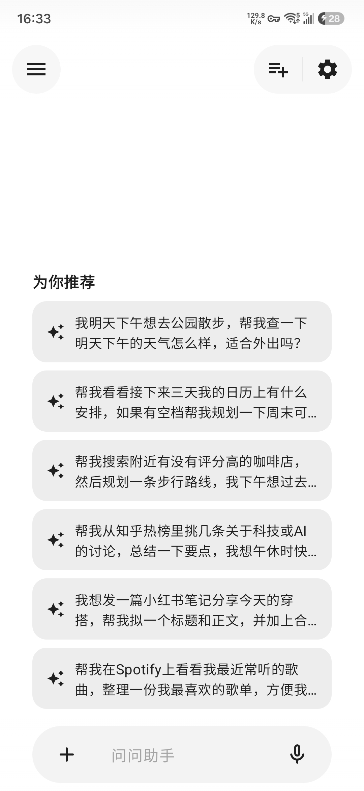
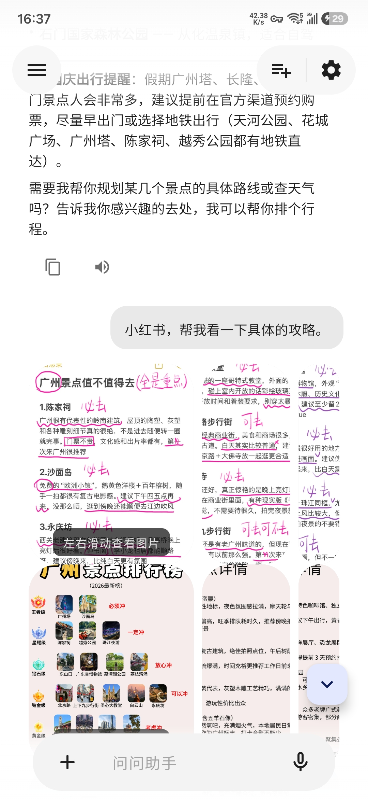
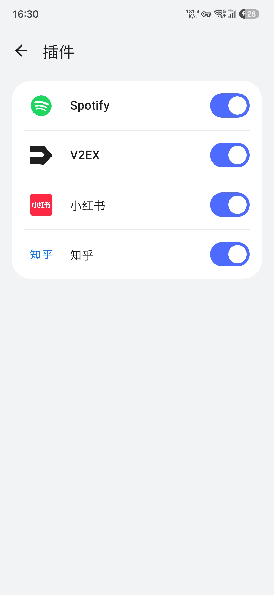
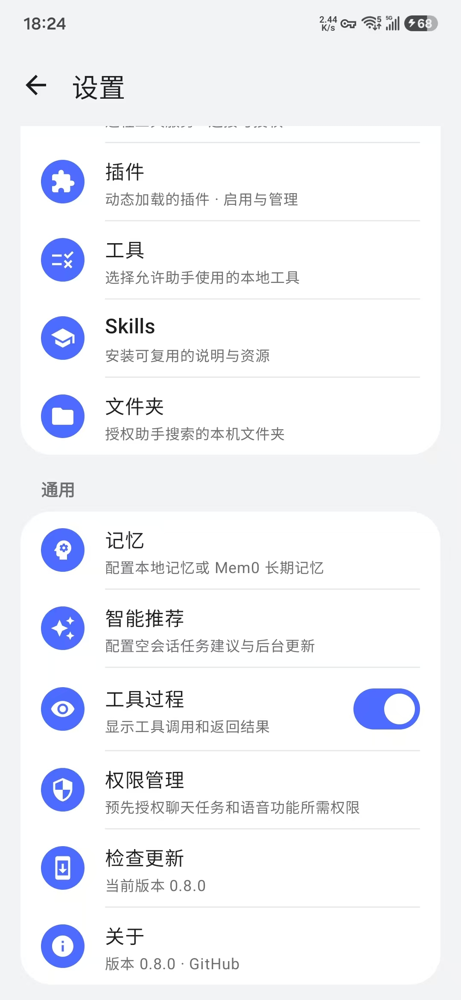

# Gimi

**一个随身的 AI 助手。**

像 Claude、豆包、元宝一样自然地聊天和语音对话；再把闹钟、日程、文件、音乐、插件与 MCP 工具真正接到手机上。

[简体中文](README.md) · [English](README.EN.md)

---

## 应用截图

  
  
  
  

## Demo 展示

  <video src="https://github.com/user-attachments/assets/855737f5-61e6-4e77-88f4-bfe5385009eb" controls playsinline width="320">
    <a href="https://github.com/user-attachments/assets/855737f5-61e6-4e77-88f4-bfe5385009eb">观看演示视频</a>
  </video>

## 能干什么

填入自己的 API Key 后，Gimi 就能在你的授权范围内帮你操作设备：设闹钟、看日程、播放媒体、调节屏幕亮度、访问指定文件夹，还能使用你接入的插件和外部工具。

## 功能

### 聊天

流式回复，支持拍照或相册发图，也能从其他应用分享图片和文档。图片可直接在对话中预览；本地文件搜索结果直接呈现在对话里。可选择显示每一次工具调用及其返回结果。

空会话可展示由 Agent 根据已启用工具、插件和你允许提供的上下文生成的任务建议，点一下即可开始；可在设置中关闭、立即刷新或调整后台更新间隔。

### 语音

点按说话，或者设唤醒词后台待命。连接蓝牙耳机后，Gimi 用离线唤醒模型在后台监听 —— 说声「吉米」再报出任务，不动手机就能执行。

### 内置工具

| 工具    | 能力                   |
|--------|------------------------|
| **时间** | 闹钟、倒计时、看时间        |
| **日历** | 查看和创建日程            |
| **媒体** | 播放、暂停、切歌（支持其他应用） |
| **音量** | 读取和调节媒体音量          |
| **显示** | 亮度、自动亮度、息屏时间      |
| **位置** | 获取位置、地图打开          |
| **文件** | 搜索图片、视频、音频和授权的文档 |
| **应用** | 查看、搜索、打开应用；拍照、录像 |
| **联系** | 拨号、发短信、查联系人       |
| **网页** | 联网搜索、打开链接          |
| **设置** | 跳转系统设置页            |

### MCP

连接远程 MCP 服务器（SSE 或 Streamable HTTP），想加什么工具都行。手动新建，或者把文档里的 `mcpServers` JSON、甚至一条 curl 命令直接粘进来，Gimi 会帮你解析。可设置 Bearer Token 和自定义请求头，测试连接，并查看每个服务器暴露的工具、资源和提示词；可随时停用。

#### 推荐服务器

| 服务器          | 能带来什么                                 | 文档                                                        | 接入方式                                               |
|-----------------|--------------------------------------------|-------------------------------------------------------------|--------------------------------------------------------|
| **高德 AMap**   | 地图：地理编码、路径规划、周边搜索、天气      | [lbs.amap.com/api/mcp-server/summary](https://lbs.amap.com/api/mcp-server/summary) | `https://mcp.amap.com/mcp?key=你的Key`（Streamable HTTP） |

在 *设置 → MCP* 里点「导入」，把上面文档中的 `mcpServers` JSON 或 curl 片段粘进去即可。

### 插件

安装 APK 插件扩展能力，刷新列表即生效，无需重启。插件自带工具，还支持应用内授权流程。内置插件有 **Spotify**（搜索、播放、歌单、音乐库）、**知乎**（搜索、热榜、问答）、**V2EX**（提醒、节点/主题/回复浏览、账号信息，需 Personal Access Token）和 **小红书**（登录、浏览推荐与搜索、查看主页和笔记、评论与互动、通知，以及图文和视频发布）。小红书插件直接通过设备上的 WebView 操作网页，不需要 MCP 服务器或中转地址，但目前稳定性有限；建议优先使用 MCP 服务器 [xpzouying/xiaohongshu-mcp](https://github.com/xpzouying/xiaohongshu-mcp)。第三方也可以通过公开的插件 API 自己开发。

### 记忆

默认使用设备本地记忆，在后续对话中保存和召回相关信息；也可在 *设置 → 记忆* 启用 Mem0 长期记忆。关闭记忆后不再保存或召回对话记忆；Mem0 Token 安全保存在设备上。

### 技能

从链接或本地 ZIP 安装技能包。技能就是一份指引和资源，装好后需要用的时候助手会自动调用。(不支持脚本执行)

### 工作文件

指定助手能搜的文件夹。只看得到你授权的目录，随时可撤销。

### 应用更新

*设置 → 检查更新*，有新版本直接应用内下载安装。版本发布自 GitHub。

### 掌控权在你

- 敏感操作暂停等你允许或拒绝。
- 只开放你想用的工具。
- 权限页说清楚每项权限干什么用。
- API Key 存在本机，不经过第三方。

## 模型服务

自带 API Key。Gimi 内置以下服务商的预设，也兼容任何 OpenAI 兼容或 Anthropic 协议的端点。

| 服务商                                                                                              | 接口协议                |
|-----------------------------------------------------------------------------------------------------|-------------------------|
|  **OpenAI** | OpenAI 兼容 |
|  **Anthropic** | Anthropic API |
|  **DeepSeek** | OpenAI 兼容 / Anthropic 协议 |
|  **月之暗面 Kimi** | OpenAI 兼容 / Anthropic 协议 |
|  **智谱 GLM** | OpenAI 兼容 / Anthropic 协议 |
|  **MiniMax** | OpenAI 兼容 / Anthropic 协议 |
|  **小米 MiMo** | OpenAI 兼容 / Anthropic 协议 |
|  **Gemini** | 原生 Gemini 接口 |

可配置：快速模型（会话标题）、语音识别模型、语音合成模型。

## 快速上手

1. 装 APK。需要 Android 14+。
2. *设置 → 模型服务*：选服务商，贴 Key，点「检测」。
3. *设置 → 默认模型*：选对话模型。需要语音就一并配置。
4. *设置 → 工具*：选择允许助手使用的本地工具。全可选。
5. *设置 → 权限管理*：看说明，愿意给的就给。全可选。
6. 可选：在 *设置 → 记忆* 配置本地或 Mem0 记忆，在 *设置 → 智能推荐* 管理空会话任务建议。
7. 开始聊。

想扩展的话：开语音唤醒、加 MCP 服务器、装插件或技能、授权工作文件夹。

## 隐私

Gimi 不收集任何数据：无统计埋点、无遥测、无账号，开发者也没有服务器。对话保存在你的设备上，
网络请求只发往你自行配置的服务（模型服务、语音、MCP 服务器）以及用于检查更新的 GitHub。
详见[隐私政策](PRIVACY.zh-CN.md) · [Privacy Policy](PRIVACY.md)。

## 致谢

- [GetStream/chat-ai-samples](https://github.com/GetStream/chat-ai-samples)
- [mikepenz/multiplatform-markdown-renderer](https://github.com/mikepenz/multiplatform-markdown-renderer)
- [google/adk-kotlin](https://github.com/google/adk-kotlin)
- [MediaPipe Text Embedder（Android）](https://developers.google.com/edge/mediapipe/solutions/text/text_embedder/android)
- [xpzouying/xiaohongshu-mcp](https://github.com/xpzouying/xiaohongshu-mcp)
- [V2EX API](https://www.v2ex.com/go/v2exapi)
- [知乎开放平台](https://developer.zhihu.com/docs)
- [高德 MCP 服务](https://lbs.amap.com/api/mcp-server/summary)

## 开源协议

[Apache License 2.0](LICENSE)
