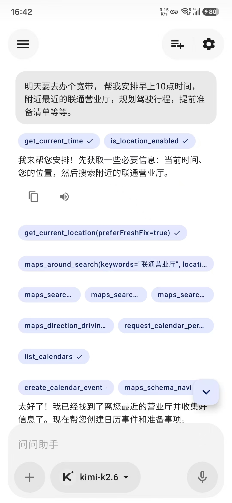
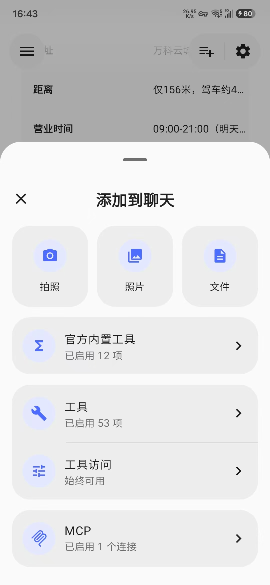
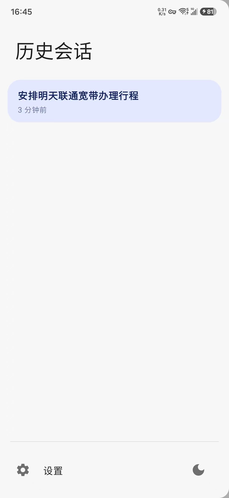
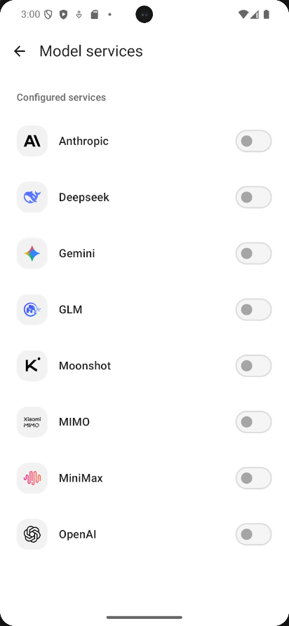

# Gimi

**An AI assistant on your phone.**

Chat, talk, and get things done — alarms, files, music, calendar — all in one app.

[English](README.md) · [简体中文](README.zh-CN.md)

---

## Screenshots

  
  
  
  

## What it does

You bring your own API key. Gimi gives its model access to your device: alarms, calendar, media,
screen brightness, folders you pick, and any external tools you add. No vendor lock-in. No
subscription.

## Features

### Chat

Stream replies. Attach photos from camera or gallery, or share images and documents from other apps.
Local file search results render right in the conversation, and you can watch each tool call as it
happens.

### Voice

Tap-to-talk, or set a wake word for hands-free use. Paired with a Bluetooth headset, Gimi listens in
the background with an offline wake-word model — say "Gimi" and speak a task, and it runs without
touching the screen.

### Built-in tools

| Tool         | What it does                                          |
|--------------|-------------------------------------------------------|
| **Time**     | Alarms, timers, clock                                 |
| **Calendar** | View and create events                                |
| **Media**    | Play, pause, skip — works across apps                 |
| **Audio**    | Read and adjust media volume                          |
| **Display**  | Brightness, auto-brightness, screen timeout           |
| **Location** | Get location, open in maps                            |
| **Files**    | Search photos, videos, audio, documents you've shared |
| **Apps**     | List, search, open apps; take photo/video             |
| **Contact**  | Dial, message, lookup                                 |
| **Web**      | Web search, open links                                |
| **Settings** | Jump to system settings pages                         |

### MCP

Connect remote MCP servers (SSE or Streamable HTTP) to give the assistant any tools you want. Add a
server manually, or paste an `mcpServers` JSON or a curl snippet straight from the docs — Gimi parses
it for you. Set a bearer token or custom headers, test the connection, and inspect the tools,
resources, and prompts each server exposes. Disable any server anytime.

#### Recommended servers

| Server          | What it gives you                                   | Docs                                                        | Connect                                              |
|-----------------|-----------------------------------------------------|-------------------------------------------------------------|------------------------------------------------------|
| **Mem0**        | Long-term memory — remembers you between sessions   | [docs.mem0.ai/platform/mem0-mcp](https://docs.mem0.ai/platform/mem0-mcp) | `https://mcp.mem0.ai/mcp` (Streamable HTTP, API key) |
| **AMap (高德)** | Maps: geocoding, route planning, POI search, weather | [lbs.amap.com/api/mcp-server](https://lbs.amap.com/api/mcp-server)       | `https://mcp.amap.com/mcp?key=YOUR_KEY` (Streamable HTTP) |

In *Settings → MCP*, tap **Import** and paste the `mcpServers` JSON or curl snippet from the docs
above.

### Plugins

Install APK plugins for extra capabilities, then refresh the list — no restart needed. Plugins bring
their own tools and can run an in-app authorization flow. Bundled plugins include **Spotify**
(search, playback, playlists, your library) and **知乎 Zhihu** (search, hot lists, Q&A). Third
parties can build their own with the public plugin API.

### Skills

Install instruction packs from a URL or local ZIP. A skill bundles guidance and resources the
assistant can use when needed. (No script execution)

### Working files

Pick folders for the assistant to search. Only folders you authorize are visible. Revoke anytime.

### App updates

Check for new versions and install in place from *Settings → Check for updates*. Releases ship from
GitHub.

### You're in control

- Sensitive actions pause and wait for Allow/Reject.
- Enable only the tools you want.
- Permissions page explains what each one does.
- API keys stay on-device; never pass through third parties.

## Model services

Bring your own API key. Gimi ships with presets for the providers below, and works with any
OpenAI-compatible or Anthropic-style endpoint.

| Provider                                                                                             | API protocol            |
|------------------------------------------------------------------------------------------------------|-------------------------|
|  **OpenAI** | OpenAI-compatible |
|  **Anthropic** | Anthropic API |
|  **DeepSeek** | OpenAI & Anthropic |
|  **Moonshot (Kimi)** | OpenAI & Anthropic |
|  **GLM (Zhipu)** | OpenAI & Anthropic |
|  **MiniMax** | OpenAI & Anthropic |
|  **MiMo (Xiaomi)** | OpenAI & Anthropic |
|  **Gemini** | Native Gemini API |

Also configurable: a quick model for conversation titles, a speech recognition model, and a speech
synthesis model.

## Getting started

1. Install the APK. Requires Android 14+.
2. *Settings → Model services*: pick a provider, paste your key, tap **Test**.
3. *Settings → Default models*: choose your chat model. Add voice models if needed.
4. *Settings → Tools*: enable the local tools you're comfortable with. All optional.
5. *Settings → Permissions*: grant what you need. All optional.
6. Start chatting.

Optional: enable voice wake, add MCP servers, install plugins or skills, authorize working folders.

## Thanks

- [GetStream/chat-ai-samples](https://github.com/GetStream/chat-ai-samples)
- [mikepenz/multiplatform-markdown-renderer](https://github.com/mikepenz/multiplatform-markdown-renderer)
- [google/adk-kotlin](https://github.com/google/adk-kotlin)

## License

[Apache License 2.0](LICENSE)
